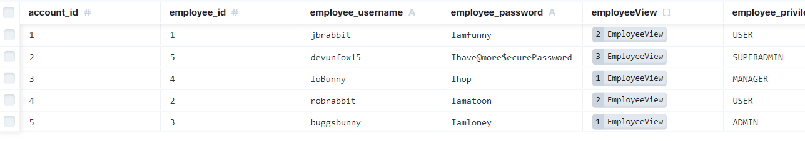

steps I have taken so far in writing the structure
First I have formated the pages to have their own unique route
second I put minimal effort into each page by adding just a H1 tag
to talk about that page in specific. 

Started a new folder with in the repo called shift-scan
 npx create next-app

Imports and why i am using them with our app:

In this section, you'll see how we can internationalize the new app directory with the use of i18next, react-i18next and i18next-resources-to-backend.
npm install i18next react-i18next i18next-resources-to-backend
https://locize.com/blog/next-app-dir-i18n/
https://www.youtube.com/watch?v=fKaJYydim3Q

New day: picking up where I left off 5/22/24

npm install --save next react react-dom

npm install --save-dev typescript @types/react @types/node

npm install --save-dev eslint @typescript-eslint/parser @typescript-eslint/eslint-plugin eslint-config-next

npm install --save-dev eslint-plugin-next

i then uninstalled node and reinstalled it and fix the error with next/babel that i was having.

I got it working, now i am making a button switch component
npm install nookies

account-info prisma db
